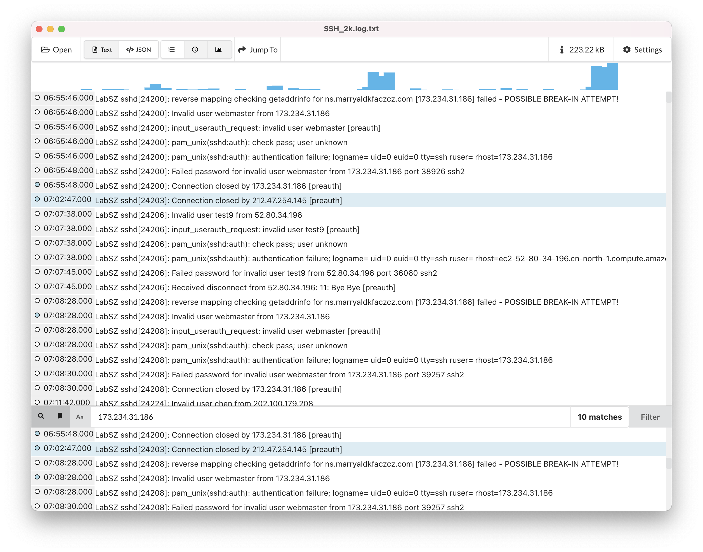

# LogVue

LogVue is a desktop log research tool. Inspired by an older [Glogg](http://glogg.bonnefon.org) application, it has been implemented in the modern Electron framework to allow richer analysis and faster iteration.  

LogVue can open large log files without crashing. It allows efficient searching and filtering to quickly narrow down to the relevant information. At this time LogVue works with with local text files (plain text or JSON) but in the future it will support various remoting protocols like S3 and SSH.

[![Build Status][github-actions-status]][github-actions-url]
[![Github Tag][github-tag-image]][github-tag-url]

## Features
* Open large files (tested up to 20GB)
* Plain text files or JSON formatted 
* Filtering 
* Marking lines 
* Keyboard navigation
